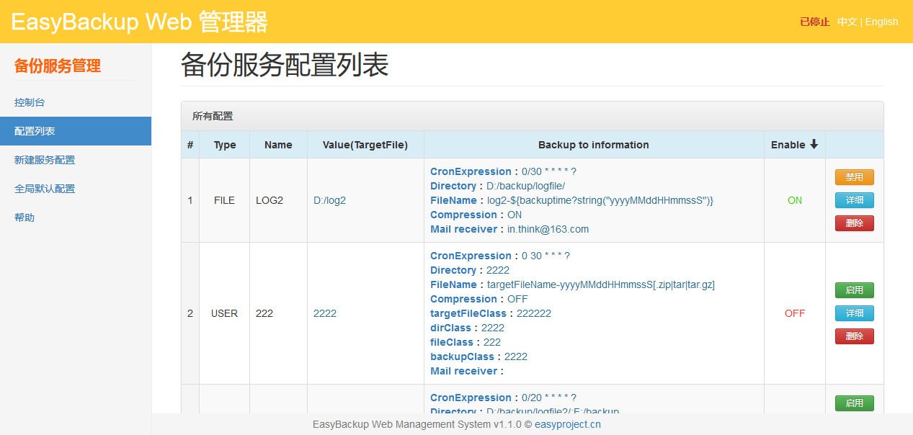
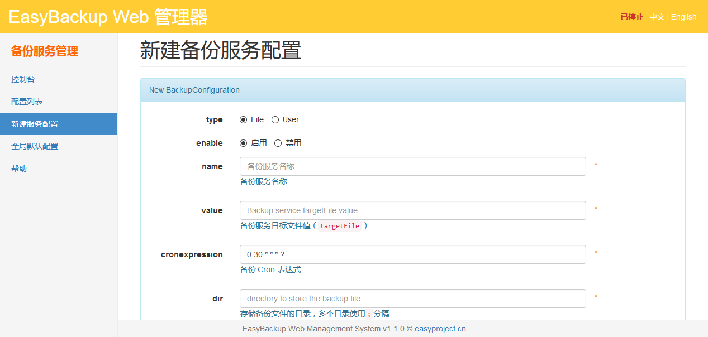

# EasyBackup Web Manger

EasyBackup Web Manger 是一个基于 [EasyBackup 框架引擎](https://github.com/ushelp/EasyBackup "移步 EasyBackup") 的 Java Web 管理器，可以在 Web UI 下完成备份配置管理，备份启动，停止控制。

如需使用，请先了解 [EasyBackup](https://github.com/ushelp/EasyBackup "移步 EasyBackup")。

## 使用

1. 将 easybackup-web.war 部署到 Web 容器（Tomcat，Jetty...）

2. 访问 http://127.0.0.1:8888/easybackup-web/

## 功能简介

### 控制台
启动，停止，监控备份服务运行状态。

### 配置列表
备份配置服务列表；查看，修改，删除，启用，禁用服务项。

### 新建服务配置
添加新备份服务配置。

### 全局默认配置
配置备份服务的默认全局配置。

### 帮助
配置示例。

## 项目配置信息

### EasyBackup 核心配置文件
**提醒**：如果有必要，请注意备份以下核心配置文件，以防止运维时误删除您创建的备份配置。
- 备份核心配置文件 `/easybackup.properties` 
- 邮件发送模板目录 `/template/`

### EasyBackup Web I18N 配置文件

- 国际化配置 `/WEB-INF/classes/easybackup_lang_country.properties`

## End

[官方主页](http://www.easyproject.cn/easybackup/zh-cn/index.jsp '官方主页')

[留言评论](http://www.easyproject.cn/easybackup/zh-cn/index.jsp#donation '留言评论')

如果您有更好意见，建议或想法，请联系我。

Email：<inthinkcolor@gmail.com>

[http://www.easyproject.cn](http://www.easyproject.cn "EasyProject Home")

**支付宝钱包扫一扫捐助：**

我们相信，每个人的点滴贡献，都将是推动产生更多、更好免费开源产品的一大步。

**感谢慷慨捐助，以支持服务器运行和鼓励更多社区成员。**

</img>
